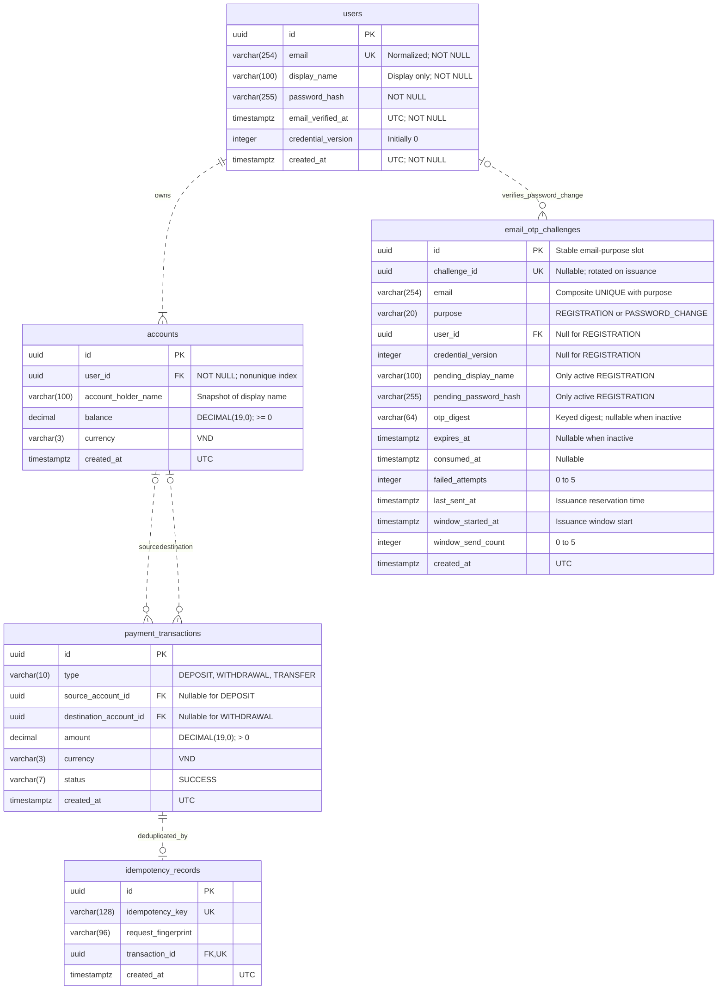

# Database ERD

Target: SRS revision 1.2, email/password registration with email OTP. All five tables were created and constraint-tested in PostgreSQL 17 on 2026-10-06; see [the SQL scripts](../database/README.md). User and its one-to-many Account mapping are implemented and tested separately from the pending registration/OTP services. The email_otp_challenges SQL table exists; its JPA entity and OTP service are still planned.

Each verified user owns one or more bank accounts. `accounts.user_id NOT NULL` references `users.id` and has a nonunique index; there is no UNIQUE constraint on the owner. Registration creates the first account atomically with the user. Authenticated POST /api/accounts opens further accounts for that same user. The entity collection may temporarily be empty during construction; the registration service must enforce the first-account invariant. No account deletion API is defined.

Email is trimmed and lowercased before storage; `users.email` is UNIQUE. Display names may repeat. There is no `username` or plaintext password column. The bank-account holder name is a snapshot of the display name; profile editing is outside this revision.

The OTP table has `UNIQUE(email, purpose)`. Its stable row retains issuance limits across retries and resends; the externally visible `challenge_id` rotates. Registration slots have no user FK and temporarily hold the submitted display name and password hash. Password-change slots have a user FK and credential version, but no pending registration fields. Successful registration clears its pending name/hash and OTP digest. Consumed slots retain rate counters; they can be cleaned only after the issuance window has ended and no active code remains. A new registration for an already registered email is rejected independently of this table.

An active slot requires a challenge ID, digest and expiry. Inactive slots may retain only recipient/purpose and throttling metadata after failed delivery. Enforce purpose-dependent fields, nonnegative credential versions, attempt/send-count bounds and required fields through SQL constraints plus service validation. Do not cascade user/account deletion into financial history; deletion APIs are not in scope.

Transaction checks: DEPOSIT has no source and requires a destination; WITHDRAWAL requires a source and has no destination; TRANSFER requires two distinct accounts. History indexes are `(source_account_id, created_at, id)` and `(destination_account_id, created_at, id)`. Add an OTP `expires_at` index for cleanup. The session framework stores user ID and credential version; sessions are not another business table in this model.

PostgreSQL implementation detail: password-change OTPs use a composite FK `(user_id, email)` to `users(id, email)` with a supporting UNIQUE pair. Registration rows have a null user_id. The single-column user FK relationship drawn above summarizes this recipient-binding constraint. Monetary validation before persistence, the first-account invariant and time-based OTP checks remain service responsibilities.
